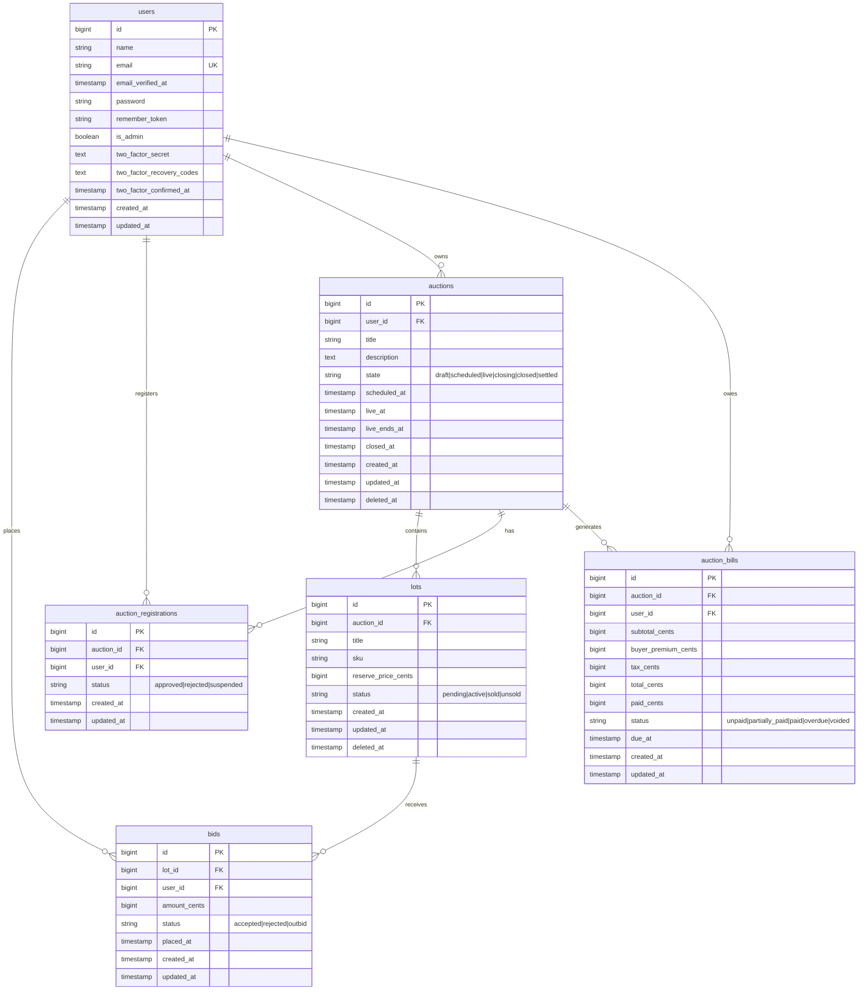

# Database ER Diagram

Last Updated: January 10, 2026

This document is intended to highlight the entity relationship plan the backend engineer intends to build for the web app.

Information can be outdated. Be sure to check the above Last Updated date as well as the Git Revision history. For any questions, contact the backend developer @ {insert contact information here}.

## Entity Relationship Diagram

## Relationships

### Auction Ownership
- **Users** own **Auctions** (one-to-many)
- By extension, lots within an auction are implicitly owned by the auction's owner

### Core Auction Flow
- **Auctions** contain multiple **Lots**
- **Lots** receive multiple **Bids** from users
- **Auction Bills** aggregate all winning lots for a user in an auction

### User Participation
- **Users** place **Bids** on lots
- **Users** participate in auctions via **Auction Registrations**
- Only approved participants can bid

### Billing & Payment
- Each **User** has at most one **Auction Bill** per auction (unique constraint on auction_id, user_id)
- **Auction Bill** aggregates totals from all lots won by the user in an auction

## Key Constraints

- `auction_registrations`: Unique constraint on `(auction_id, user_id)` prevents duplicate registrations
- `auction_bills`: Unique constraint on `(auction_id, user_id)` ensures one bill per user per auction
- All foreign keys use `cascadeOnDelete` for referential integrity
- Composite index on `bids(lot_id, amount_cents)` for efficient bid querying

## State Enums

Refer to `app/Enums/` for authoritative enum values:
- `AuctionState`: Draft, Scheduled, Live, Closing, Closed, Settled
- `LotStatus`: Pending, Active, Sold, Unsold
- `BidStatus`: Accepted, Rejected, Outbid
- `AuctionBillStatus`: Unpaid, PartiallyPaid, Paid, Overdue, Void
- `PaymentIntentStatus`: Initiated, Authorized, Captured, Failed
